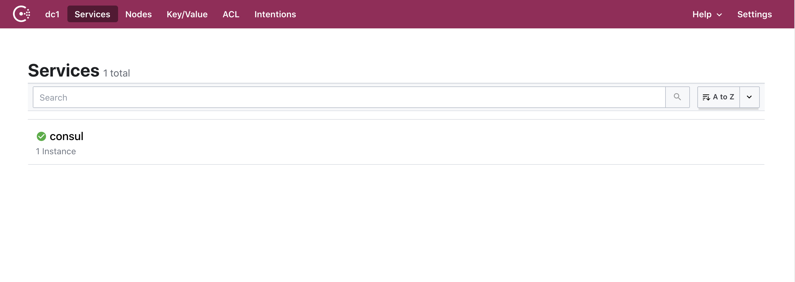
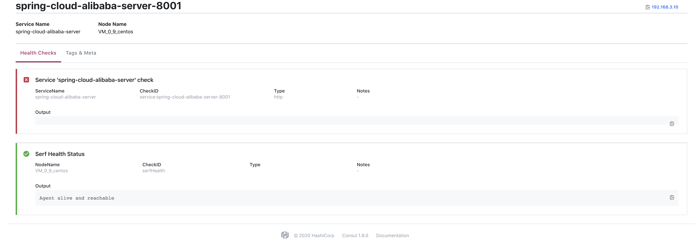

### Spring Cloud Alibaba使用Consul作为注册中心

#### 1、Consul安装

下载地址：https://www.consul.io

下载后使用unzip命令进行解压

启动运行

```shell
./consul agent -dev -ui -client=0.0.0.0
nohup ./consul agent -dev -ui -client=0.0.0.0 -data-dir=./data >> ./logs/consul.log &
启动检查 netstat -anp|grep 8500
```

启动后，访问8500端口，打开consul后台管理页面



#### 2、导入提供者和消费者所属项目的主要依赖

* 提供者必要的依赖

  ```java
  <dependency>
  			<groupId>org.springframework.boot</groupId>
  			<artifactId>spring-boot-starter-web</artifactId>
  </dependency>
  <!--健康检查-->
  <dependency>
  			<groupId>org.springframework.boot</groupId>
  			<artifactId>spring-boot-starter-actuator</artifactId>
  </dependency>
  <!--加入Consul的服务注册与发现模块-->
  <dependency>
  			<groupId>org.springframework.cloud</groupId>
  			<artifactId>spring-cloud-starter-consul-discovery</artifactId>
  </dependency>
  ```

* 消费者必要的依赖

  ```java
  <dependency>
  			<groupId>org.springframework.boot</groupId>
  			<artifactId>spring-boot-starter-web</artifactId>
  </dependency>
  <!--健康检查-->
  <dependency>
  			<groupId>org.springframework.boot</groupId>
  			<artifactId>spring-boot-starter-actuator</artifactId>
  </dependency>
  <!--加入Consul的服务注册与发现模块-->
  <dependency>
  			<groupId>org.springframework.cloud</groupId>
  			<artifactId>spring-cloud-starter-consul-discovery</artifactId>
  </dependency>
  <dependency>
  			<groupId>io.github.openfeign</groupId>
  			<artifactId>feign-httpclient</artifactId>
  </dependency>
  <dependency>
  			<groupId>org.springframework.cloud</groupId>
  </dependency>
  ```

  

###  3、提供者和消费者项目配置

* 提供者配置

  ```yaml
  spring:
    application:
      # 项目名-必须要和配置中心的值保持一致
      name: provider
    cloud:
      consul:
        host: slave1
        port: 8500
        # 服务发现相关配置
        discovery:
          service-name: ${spring.application.name}      # 服务名称
          register: true                                # 是否需要注册
          instance-id: ${spring.application.name}-${server.port}    # 注册实例 id（必须唯一）
          port: ${server.port}                          # 服务端口
          prefer-ip-address: true                       # 是否使用 ip 地址注册
          ip-address: ${spring.cloud.client.ip-address} # 服务请求 ip
  ```

> Ps:prefer-ip-address: true ,如果你不用ip进行注册，Consul将无法向服务发起检查，会认为服务不可用，导致无法调用



* 消费者配置

```yaml
spring:
  application:
    # 项目名-必须要和配置中心的值保持一致
    name: consumer
  cloud:
    consul:
      host: slave1
      port: 8500
      # 服务发现相关配置
      discovery:
        register: true                                # 是否需要注册
        instance-id: ${spring.application.name}-${server.port}    # 注册实例 id（必须唯一）
        service-name: ${spring.application.name}      # 服务名称
        port: ${server.port}                          # 服务端口
        prefer-ip-address: true                       # 是否使用 ip 地址注册
        ip-address: ${spring.cloud.client.ip-address} # 服务请求 ip

feign:
  httpclient:
    # 让feign使用Apache HttpClient做请求
    enabled: true
    # feign的最大连接数
    max-connections: 200
    # feign单个路径的最大连接数
    max-connections-per-route: 50
  sentinel:
    enabled: true
```

### 4、生产者业务代码

项目启动入口

```java
@SpringBootApplication
@EnableDiscoveryClient
public class AlibabaNacosDiscoveryServerApplication {

	private static Logger logger = LoggerFactory.getLogger(AlibabaNacosDiscoveryServerApplication.class);

	public static void main(String[] args) {
		/// SpringApplication.run(AlibabaNacosDiscoveryServerApplication.class, args);
		SpringApplication springApplication = new SpringApplication(AlibabaNacosDiscoveryServerApplication.class);
		// 禁止命令行设置参数
		springApplication.setAddCommandLineProperties(false);
		springApplication.run(args);
		//项目启动完成打印项目名
		logger.warn("服务提供者已经启动 ... ");
	}

}
```

对外提供的接口

```java
@RestController
@RequestMapping(value = "/server/api")
public class ApiController {

    private static Logger logger = LoggerFactory.getLogger(ApiController.class);

    /**
     * @描述
     * @参数  [name]
     * @返回值  java.lang.String
     * @创建人  saya.ac.cn-刘能凯
     * @创建时间  2019/1/20
     * @修改人和其它信息
     * 查询用户
     */
    @GetMapping(value = "/user/{name}")
    public String getUserInfo(@PathVariable(value = "name") String name){
        logger.info("正在查询：" + name);
        return "正在为您查询‘" + name + "’用户，请稍等.....，该用户的信息如下：";
    }
}
```

### 5、消费者业务代码

项目启动入口

```java
@EnableDiscoveryClient
@SpringBootApplication
@EnableFeignClients
public class AlibabaNacosDiscoveryClientApplication {

	private static Logger logger = LoggerFactory.getLogger(AlibabaNacosDiscoveryClientApplication.class);

	public static void main(String[] args) {
		///SpringApplication.run(AlibabaNacosDiscoveryClientApplication.class, args);
		SpringApplication springApplication = new SpringApplication(AlibabaNacosDiscoveryClientApplication.class);
		// 禁止命令行设置参数
		springApplication.setAddCommandLineProperties(false);
		springApplication.run(args);
		//项目启动完成打印项目名
		logger.warn("服务消费者已经启动 ... ");
	}

}
```

Feign接口

```java
@FeignClient(value = "spring-cloud-alibaba-server")
public interface ApiFeignService {

    /**
     * @描述
     * @参数  [name]
     * @返回值  java.lang.String
     * @创建人  saya.ac.cn-刘能凯
     * @创建时间  2019/1/20
     * @修改人和其它信息
     * 查询用户
     */
    @GetMapping(value = "/server/api/user/{name}")
    public String getUserInfo(@PathVariable(value = "name") String name);

}
```

调用提供者接口

```java
@RestController
@RequestMapping(value = "user")
public class UserController {

    private static Logger logger = LoggerFactory.getLogger(UserController.class);

    @Autowired
    private ApiFeignService apiFeignService;

    @GetMapping(value = "/query/{name}")
    public String queryUserInfo(@PathVariable(value = "name") String name) {
        String result = apiFeignService.getUserInfo(name);
        logger.info("return : " + result);
        return "return : " + result;
    }
    
}
```


> 正常注册的项目

