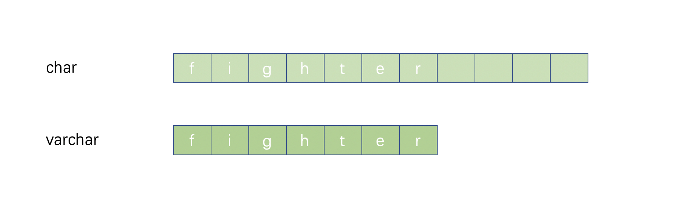
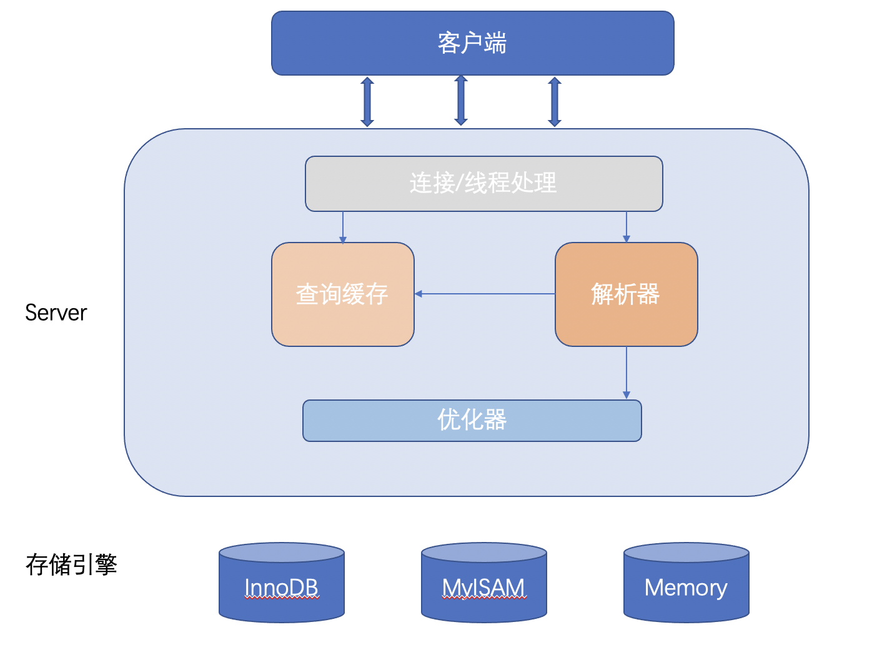
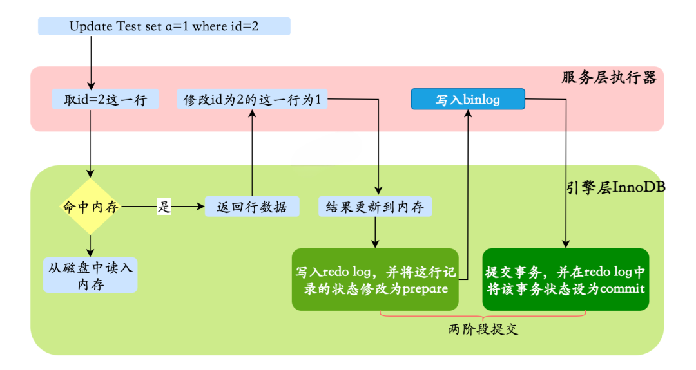

## 1. 什么是内连接、外连接、交叉连接、笛卡尔积呢？

内连接（inner join）：取得两张表中满足存在连接匹配关系的记录。
外连接（outer join）：不只取得两张表中满足存在连接匹配关系的记录，还包括某张表（或两张表）中不满足
匹配关系的记录。
交叉连接（cross join）：显示两张表所有记录一一对应，没有匹配关系进行筛选，它是笛卡尔积在 SQL 中的实
现，如果 A 表有 m 行，B 表有 n 行，那么 A 和 B 交叉连接的结果就有 m*n 行。
笛卡尔积：是数学中的一个概念，例如集合 A={a,b}，集合 B={1,2,3}，那么 AxB= {<a,o>,<a,1>,<a,2>,<b,0>,<b,1>,<b,2>}

## 2. MySQL 的内连接、左连接、右连接有有什么区别？

inner join 内连接，在两张表进行连接查询时，只保留两张表中完全匹配的结果集
left join 在两张表进行连接查询时，会返回左表所有的行，即使在右表中没有匹配的记录。
right join 在两张表进行连接查询时，会返回右表所有的行，即使在左表中没有匹配的记录。

## 3. 数据库的三大范式？

第一范式：数据表中的每一列（每个字段）都不可以再拆分。例如用户表，用户地址还可以拆分成国家、省份、市，这样才是符合第一范式的。
第二范式：在第一范式的基础上，非主键列完全依赖于主键，而不能是依赖于主键的一部分。例如订单表里，存储了商品信息（商品价格、商品类型），那就需要把商品 ID 和订单 ID 作为联合主键，才满足第二范
式。
第三范式：在满足第二范式的基础上，表中的非主键只依赖于主键，而不依赖于其他非主键。例如订单表，就不能存储用户信息（姓名、地址）。

三大范式的作用是为了控制数据库的冗余，是对空间的节省，实际上，一般互联网公司的设计都是反范式的，通过冗余一些数据，避免跨表跨库，利用空间换时间，提高性能。

## 4. varchar 与 char 的区别？

char：

1. char 表示定长字符串，长度是固定的；

2. 如果插入数据的长度小于 char 的固定长度时，则用空格填充；

3. 因为长度固定，所以存取速度要比 varchar 快很多，甚至能快 50%，但正因为其长度固定，所以会占据多余的空间，是空间换时间的做法；

4. 对于 char 来说，最多能存放的字符个数为 255，和编码无关

   

varchar：

1. varchar 表示可变长字符串，长度是可变的；
2. 插入的数据是多长，就按照多长来存储；
3. varchar 在存取方面与 char 相反，它存取慢，因为长度不固定，但正因如此，不占据多余的空间，是时间换空间的做法；
   对于 varchar 来说，最多能存放的字符个数为 65532

日常的设计，对于长度相对固定的字符串，可以使用 char，对于长度不确定的，使用 varchar 更合适一些。

## 5. blob 和 text 有什么区别？

blob 用于存储二进制数据，而 text 用于存储大字符串。
blob 没有字符集，text 有一个字符集，

## 6. DATETIME 和 TIMESTAMP 的异同

相同点：
1. 两个数据类型存储时间的表现格式一致。均为`YYYY-MM-DD HH:MM:SS`
2. 两个数据类型都包含「日期」和「时间」部分。
3. 两个数据类型都可以存储微秒的小数秒（秒 后 6 位小数秒）

区别：

1. 日期范围：DATETIME 的日期范围是 1000-01-01 00:00:00.000000 到 9999-12-3123:59:59.999999;TIMESTAMP 的时间范围是1970-01-01 00:00:01.000000' 到 '2038-01-19 03:14:07.999999
2. 存储空间：DATETIME的存储空间为 8 字节；TIMESTAMP 的存储空间为 4 字节
3. 时区相关：DATETIME 存储时间与时区无关；TIMESTAMP 存储时间与时区有关，显示的值也依赖于时区
4. 默认值：DATETIME 的默认值为 null；TIMESTAMP 的字段默认不为空(not null)，默认值为当前时间
   (CURRENT_TIMESTAMP)

## 7.MySQL 中 in 和 exists 的区别

MySQL 中的 in 语句是把外表和内表作 hash 连接，而 exists 语句是对外表作 loop 循环，每次 loop 循环再对内表进行查询。我们可能认为 exists 比 in 语句的效率要高，这种说法其实是不准确的，要区分情景：

1. 如果查询的两个表大小相当，那么用 in 和 exists 差别不大。

2. 如果两个表中一个较小，一个是大表，则子查询表大的用 exists，子查询表小的用 in。
3. not in 和 not exists：如果查询语句使用了 not in，那么内外表都进行全表扫描，没有用到索引；而 not extsts
的子查询依然能用到表上的索引。所以无论那个表大，用 not exists 都比 not in 要快。

## 8. MySQL 里记录货币用什么字段类型比较好

货币在数据库中 MySQL 常用 Decimal 和 Numric 类型表示，这两种类型被 MySQL 实现为同样的类型。他们被用于保存与货币有关的数据。
例如 ：DECIMAL(9,2)，9(precision)代表将被用于存储值的总的小数位数，而 2(scale)代表将被用于存储小数点后的位数。存储在 salary 列中的值的范围是从-9999999.99 到 9999999.99。
DECIMAL 和 NUMERIC 值作为字符串存储，而不是作为二进制浮点数，以便保存那些值的小数精度。 之所以不使用 float 或者 double 的原因：因为 float 和 double 是以二进制存储的，所以有一定的误差。

## 9. MySQL 怎么存储 emoji ?

MySQL 可以直接使用字符串存储 emoji。
但是需要注意的，utf8 编码是不行的，MySQL 中的 utf8 是阉割版的 utf8，它最多只用 3 个字节存储字符，所以存储不了表情。那该怎么办？
需要使用 utf8mb4 编码。

## 10. drop、delete 与 truncate 的区别？

三者都表示删除，但是三者有一些差别：

| 区别点          | drop                                             | truncate                                       | delete                                                   |
| --------------- | ------------------------------------------------ | ---------------------------------------------- | -------------------------------------------------------- |
| 执行速度        | 快                                               | 较快                                           | 慢                                                       |
| 命令分类        | DDL（数据定义语言）                              | DDL（数据定义语言）                            | DML（数据操作语言）                                      |
| 删除对象        | 删除整张表和表结构，以及表的索引、约束和触发器。 | 只删除表数据，表的结构、索引、约束等会被保留。 | 只删除表的全部或部分数据，表结构、索引、约束等会被保留。 |
| 删除条件(where) | 不能用                                           | 不能用                                         | 可使用                                                   |
| 回滚            | 不可回滚                                         | 不可回滚                                       | 可回滚                                                   |
| 自增初始值      | -                                                | 重置                                           | 不重置                                                   |

## 11. UNION 与 UNION ALL 的区别？

如果使用 UNION，会在表链接后筛选掉重复的记录行如
如果使用 UNION ALL，不会合并重复的记录行
从效率上说，UNION ALL 要比 UNION 快很多，如果合并没有刻意要删除重复行，那么就使用 UNION Al

## 12. count(1)、count(*) 与 count(列名) 的区别

执行效果：

- count(\*)包括了所有的列，相当于行数，在统计结果的时候，不会忽略列值为 NULL
- count(1)包括了忽略所有列，用 1 代表代码行，在统计结果的时候，不会忽略列值为 NULL
- count(列名)只包括列名那一列，在统计结果的时候，会忽略列值为空（这里的空不是只空字符串或者 0，而是表示 null）的计数，即某个字段值为 NULL 时，不统计。

执行速度：

- 列名为主键，count(列名)会比 count(1)快 
- 列名不为主键，count(1)会比 count(列名)快
- 如果表多个列并且没有主键，则 count（1） 的执行效率优于 count（\*）
- 如果有主键，则 select count（主键）的执行效率是最优的
- 如果表只有一个字段，则 select count（*）最优

## 13. 一条 SQL查询语句的执行顺序？

1. FROM：对 FROM 子句中的左表<left_table>和右表<right_table>执行笛卡儿积（Cartesianproduct），产生虚拟
表 VT1
2. ON：对虚拟表 VT1 应用 ON 筛选，只有那些符合<join_condition>的行才被插入虚拟表 VT2 中
3. JOIN：如果指定了 OUTER JOIN（如 LEFT OUTER JOIN、RIGHT OUTER JOIN），那么保留表中未匹配的行作为外
部行添加到虚拟表 VT2 中，产生虚拟表 VT3。如果 FROM 子句包含两个以上表，则对上一个连接生成的结果
表 VT3 和下一个表重复执行步骤 1）～步骤 3），直到处理完所有的表为止
4. WHERE：对虚拟表 VT3 应用 WHERE 过滤条件，只有符合<where_condition>的记录才被插入虚拟表 VT4 中
5. GROUP BY：根据 GROUP BY 子句中的列，对 VT4 中的记录进行分组操作，产生 VT5
6. CUBE|ROLLUP：对表 VT5 进行 CUBE 或 ROLLUP 操作，产生表 VT6
7. HAVING：对虚拟表 VT6 应用 HAVING 过滤器，只有符合<having_condition>的记录才被插入虚拟表 VT7
中。
8. SELECT：第二次执行 SELECT 操作，选择指定的列，插入到虚拟表 VT8 中
9. DISTINCT：去除重复数据，产生虚拟表 VT9
10. ORDER BY：将虚拟表 VT9 中的记录按照<order_by_list>进行排序操作，产生虚拟表 VT10。
11. LIMIT：取出指定行的记录，产生虚拟表 VT11，并返回给查询用户

## 14.  MySQL 的基础架构

- 客户端：最上层的服务并不是 MySQL 所独有的，大多数基于网络的客户端/服务器的工具或者服务都有类似的
  架构。比如连接处理、授权认证、安全等等。
- Server 层：大多数 MySQL 的核心服务功能都在这一层，包括查询解析、分析、优化、缓存以及所有的内置函
  数（例如，日期、时间、数学和加密函数），所有跨存储引擎的功能都在这一层实现：存储过程、触发 器、
  视图等。
- 存储引擎层：第三层包含了存储引擎。存储引擎负责 MySQL 中数据的存储和提取。Server 层通过 API 与存储
  引擎进行通信。这些接口屏蔽了不同存储引擎之间的差异，使得这些差异对上层的查询过程透明。

## 15. 一条 SQL 查询语句在 MySQL 中如何执行的？

1. 先检查该语句是否有权限 ，如果没有权限，直接返回错误信息，如果有权限会先查询缓存 (MySQL8.0 版本以
   前)。
2. 如果没有缓存，分析器进行语法分析 ，提取 sql 语句中 select 等关键元素，然后判断 sql 语句是否有语法错误，比如关键词是否正确等等。
3. 语法解析之后，MySQL 的服务器会对查询的语句进行优化，确定执行的方案。
4. 完成查询优化后，按照生成的执行计划调用数据库引擎接口 ，返回执行结果。

## 16.  MySQL 有哪些常见存储引擎？

| 功能         | MylSAM | InnoDB |
| ------------ | ------ | ------ |
| 存储限制     | 256TB  | 64TB   |
| 支持事务     | No     | Yes    |
| 支持全文索引 | Yes    | Yes    |
| 支持树索引   | Yes    | Yes    |
| 支持哈希索引 | No     | Yes    |
| 支持数据缓存 | No     | Yes    |
| 支持外键     | No     | Yes    |

**InnoDB 和 MylSAM 主要区别**

1. 存储结构：每个 MyISAM 在磁盘上存储成三个文件；InnoDB 所有的表都保存在同一个数据文件中（也可能是多个文件，或者是独立的表空间文件），InnoDB 表的大小只受限于操作系统文件的大小，一般为 2GB。
2. 事务支持：MyISAM 不提供事务支持；InnoDB 提供事务支持事务，具有事务(commit)、回滚(rollback)和崩溃修复能力(crash recovery capabilities)的事务安全特性。
3. 最小锁粒度：MyISAM 只支持表级锁，更新时会锁住整张表，导致其它查询和更新都会被阻塞 InnoDB 支持行级锁。
4. 索引类型：MyISAM 的索引为非聚簇索引，数据结构是 B 树；InnoDB 的索引是聚簇索引，数据结构是 B+树。
5. 主键必需：MyISAM 允许没有任何索引和主键的表存在；InnoDB 如果没有设定主键或者非空唯一索引，**就会自动生成一个 6 字节的主键(用户不可见)**，数据是主索引的一部分，附加索引保存的是主索引的值。
6. 表的具体行数：MyISAM 保存了表的总行数，如果 select count(*) from table;会直接取出出该值; InnoDB 没有保存表的总行数，如果使用 select count(*) from table；就会遍历整个表;但是在加了wehre 条件后，MyISAM 和 InnoDB 处理的方式都一样。
7. 外键支持：MyISAM 不支持外键；InnoDB 支持外键。

## 17. 那存储引擎应该怎么选择？

- 大多数情况下，使用默认的 InnoDB 就够了。如果要提供提交、回滚和恢复的事务安全（ACID 兼容）能力，并要求实现并发控制，InnoDB 就是比较靠前的选择了。
- 如果数据表主要用来插入和查询记录，则 MyISAM 引擎提供较高的处理效率。
  

使用哪一种引擎可以根据需要灵活选择，因为存储引擎是基于表的，所以一个数据库中多个表可以使用不同的引擎以
满足各种性能和实际需求。使用合适的存储引擎将会提高整个数据库的性能

## 18. MySQL 日志文件有哪些？分别介绍下作用？

MySQL 日志文件有很多，包括 ：

- 错误日志（error log）：错误日志文件对 MySQL 的启动、运行、关闭过程进行了记录，能帮助定位 MySQL问题。
- 慢查询日志（slow query log）：慢查询日志是用来记录执行时间超过 long_query_time 这个变量定义的时长的查询语句。通过慢查询日志，可以查找出哪些查询语句的执行效率很低，以便进行优化。
- 一般查询日志（general log）：一般查询日志记录了所有对 MySQL 数据库请求的信息，无论请求是否正确执行。
- 二进制日志（bin log）：关于二进制日志，它记录了数据库所有执行的 DDL 和 DML 语句（除了数据查询语句select、show 等），以事件形式记录并保存在二进制文件中。

还有两个 InnoDB 存储引擎特有的日志文件：

- 重做日志（redo log）：重做日志至关重要，因为它们记录了对于 InnoDB 存储引擎的事务日志。
- 回滚日志（undo log）：回滚日志同样也是 InnoDB 引擎提供的日志，顾名思义，回滚日志的作用就是对数据进行回滚。当事务对数据库进行修改，InnoDB 引擎不仅会记录 redo log，还会生成对应的 undo log 日 志；如果事务执行失败或调用了rollback，导致事务需要回滚，就可以利用 undo log 中的信息将数据回滚到修改之前的样子。

## 19. binlog 和 redolog 有什么区别？

- bin log 会记录所有与数据库有关的日志记录，包括 InnoDB、MyISAM 等存储引擎的日志，而 redo log 只记InnoDB 存储引擎的日志。
- 记录的内容不同，bin log 记录的是关于一个事务的具体操作内容，即该日志是逻辑日志。而 redo log 记录的是关于每个页（Page）的更改的物理情况。
- 写入的时间不同，bin log 仅在事务提交前进行提交，也就是只写磁盘一次。而在事务进行的过程中，却不断有redo ertry 被写入 redo log 中。
- 写入的方式也不相同，redo log 是循环写入和擦除，bin log 是追加写入，不会覆盖已经写的文件。

## 20.  一条更新语句怎么执行的了解吗？

更新语句的执行是Server层和引擎层配合完成，数据除了要写入表中，还要记录相应的日志。

1. 执行器先找引擎获取ID=2这一行。ID是主键，存储引擎检索数据，找到这一行。如果ID=2这一行所在的数据页本来就在内存中，就直接返回给执行器；否则，需要先从磁盘读入内存，然后再返回。
2. 执行器拿到引擎给的行数据，把这个值加上1，比如原来是N，现在就是N+1，得到新的一行数据，再调用引擎接口写入这行新数据。
3. 引擎将这行新数据更新到内存中，同时将这个更新操作记录到redo log里面，此时redo log处于prepare状态。然后告知执行器执行完成了，随时可以提交事务。
4. 执行器生成这个操作的binlog，并把binlog写入磁盘。
5. 执行器调用引擎的提交事务接口，引擎把刚刚写入的redo log改成提交（commit）状态，更新完成。

从上图可以看出，MySQL在执行更新语句的时候，在服务层进行语句的解析和执行，在引擎层进行数据的提取和存储；同时在服务层对binlog进行写入，在InnoDB内进行redo log的写入。

不仅如此，在对redo log写入时有两个阶段的提交，一是binlog写入之前`prepare`状态的写入，二是binlog写入之后`commit`状态的写入。

https://picwish.cn/remove-unwanted-object

https://mp.weixin.qq.com/s/zSTyZ-8CFalwAYSB0PN6wA

MySQL面试题八股文.pdf