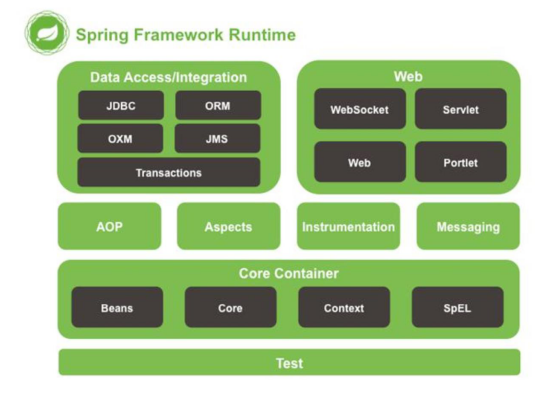

### Spring全家桶系列面试题整理

#### 1、不同版本的 Spring Framework 有哪些主要功能？

| 版本       | 更新内容                                                     |
| ---------- | ------------------------------------------------------------ |
| Spring 2.5 | 发布于2007年，这是第一个支持注解的版本。                     |
| Spring 3.0 | 发布于2009年，它完全利用了Java5中的改进，并为J2EE提供了支持。 |
| Spring 4.0 | 发布于2013年，这是第一个完全支持Java8 的版本。               |
| Spring 5.0 | 发布于2017年，支持响应式编程和函数式Web框架。                |

#### 2、什么是 Spring Framework？（重复）

Spring是一个轻量级IoC和AOP框架，是为Java应用程序提供基础性服务的一套容器，目的是简化企业应用程序的开发，它使得开发者只需关注业务需求。

#### 3、列举 Spring Framework 的优点？（重复）

低侵入、松耦合、高复用、可扩展

1. 低侵入：Spring实现IoC，无需用户代码继承或实现框架的类或接口
2. 松耦合：对象之间的依赖关系交由spring的依赖注入将，减低组件的耦合性
3. 高复用：Spring提供了AOP技术，支持将一些通用方法，如安全、事务、日志、权限等进行集中式管理，从而提供更好的复用
4. 可扩展：spring对于主流的应用框架提供了集成支持

#### 4、Spring Framework 有哪些不同的功能？（重复）

- IOC：利用反射的原理将对象创建的权利交给了Spring容器，Spring在运行的时候根据配置文件来动态的创建对象之间的关系，实现了松耦合。所谓的“控制反转”就是组件对象的控制权转移了，从程序代码本身转移到了外部容器，由容器反向的向应用程序注入应用程序所需要的外部资源
  实现控制反转的两种方式：依赖注入和依赖查找。
- DI：在Spring框架创建Bean对象时，动态的将对象所依赖属性注入到Bean中
- AOP:通过代理模式为目标对象生成代理对象，并将横切逻辑插入到目标方法的前后

#### 5、Spring Framework 中有多少个模块，它们分别是什么？



Spring 核心容器 – 该层基本上是 Spring Framework 的核心。它包含以下模块：

（1）Spring Core

（2）Spring Bean

（3）SpEL (Spring Expression Language)

（4） Spring Context

数据访问/集成 – 该层提供与数据库交互的支持。它包含以下模块：

（1）JDBC (Java DataBase Connectivity)

（2）ORM (Object Relational Mapping)

（3）OXM (Object XML Mappers)

（4）JMS (Java Messaging Service)

（5）Transaction

Web – 该层提供了创建 Web 应用程序的支持。它包含以下模块：

（1）Web

（2）Web – Servlet

（3）Web – Socket

（4）Web – Portlet

AOP

该层支持面向切面编程

Instrumentation

该层为类检测和类加载器实现提供支持。

Test

该层为使用 JUnit 和 TestNG 进行测试提供支持。

几个杂项模块:

（1）Messaging – 该模块为 STOMP 提供支持。它还支持注解编程模型，该模型用于从WebSocket 客户端路由和处理 STOMP 消息。

（2）Aspects – 该模块为与 AspectJ 的集成提供支持。

#### 6、什么是 Spring 配置文件？

Spring 配置文件是 XML 文件。该文件主要包含类信息。它描述了这些类是如何配置以及相互引入的。

#### 7、Spring 应用程序有哪些不同组件？

Spring 应用一般有以下组件：

* 接口 - 定义功能。
* Bean 类 - 它包含属性，setter 和 getter 方法，函数等。
* Spring 面向切面编程（AOP） - 提供面向切面编程的功能。
* Bean 配置文件 - 包含类的信息以及如何配置它们。
* 用户程序 - 它使用接口。

#### 8、使用 Spring 有哪些方式或场景？

* 作为一个Java Web 应用程序。
* 作为第三方 Web 框架，使用 Spring Frameworks 中间层。
* 作为企业级 Java Bean，它可以包装现有的 POJO（Plain Old JavaObjects）。

#### 9、什么是 Spring IOC 容器？（重复）

利用反射的原理将对象创建的权利交给了Spring容器，Spring在运行的时候根据配置文件来动态的创建对象之间的关系，实现了松耦合。所谓的“控制反转”就是组件对象的控制权转移了，从程序代码本身转移到了外部容器，由容器反向的向应用程序注入应用程序所需要的外部资源。

#### 10、什么是依赖注入？（重复）

在Spring框架创建Bean对象时，动态的将对象所依赖属性注入到Bean中。

#### 11、可以通过多少种方式完成依赖注入？（重复）

1. 构造函数注入
2. setter 注入

#### 12、构造函数注入和 setter 注入的区别？（重复）

| 构造函数注入             | setter 注入              |
| ------------------------ | ------------------------ |
| 不会覆盖setter属性       | 会覆盖setter属性         |
| 存在循环依赖             | 不存在循环依赖           |
| 任意修改都会创建一个实例 | 任意修改不会创建一个实例 |

#### 13、spring 中有多少种 IOC 容器？

ioc提供了BeanFactory和applicationContext两种容器

BeanFactory是Spring里面最低层的接口，提供了最简单的容器功能，只提供了实例化对象和获取对象的功能；

applicationContext，应用上下文，扩展了BeanFactory接口，它是Spring的一个更高级容器，提供了额外的功能

1. 国际化（MessageSource）
2. 统一的资源文件读取方式（ResourceLoader）
3. 载入多个（有继承关系）上下文 ，使得每一个上下文都专注于一个特定的层次，比如应用的web层
4. 消息发送、响应机制（ApplicationEventPublisher）

#### 14、区分 BeanFactory 和 ApplicationContext。

| BeanFactory              | ApplicationContext     |
| ------------------------ | ---------------------- |
| 使用懒加载               | 使用即时加载           |
| 不支持国际化             | 支持国际化             |
| 不支持基于依赖的注解     | 支持基于依赖的注解     |
| 使用语法显示提供资源对象 | 自己创建和管理资源对象 |

#### 15、列举 IoC 的一些好处。（重复）

IOC减少了应用程序的代码量，解耦合

#### 16、Spring IoC 的实现机制。

Spring 中的 IoC 的实现原理就是工厂模式加反射机制。 示例：

```java
interface Fruit {
    public abstract void eat();
}
class Apple implements Fruit {
    public void eat(){
        System.out.println("Apple");
    }
}
class Orange implements Fruit {
    public void eat(){
        System.out.println("Orange");
    }
}
class Factory {
    public static Fruit getInstance(String ClassName) {
        Fruit f=null;
        try {
            f=(Fruit)Class.forName(ClassName).newInstance();
        }
        catch (Exception e) {
            e.printStackTrace();
        }
        return f;
    }
}
class Client {
    public static void main(String[] a) {
        Fruit f=Factory.getInstance("io.github.dunwu.spring.Apple");
        if(f!=null){
            f.eat();
        }
    }
}
```

#### 17、什么是 spring bean？

1. 它们是构成用户应用程序主干的对象。
2. Bean 由 Spring IoC 容器管理。
3. 它们由 Spring IoC 容器实例化，配置，装配和管理。

#### 18、spring 提供了哪些配置方式？（重复）

1. 基于XML的配置
2. 基于注解的配置
3. 基于java的配置

#### 19.Spring Bean的作用域scope有哪些?（重复）

1. 单例singleton:默认情况下都是单例的，它要求在每个spring 容器内不论你请求多少次这个实例，都只有一个实例。单例特性是由beanfactory本身维护的。
2. 原型prototype:这个bean的实例和单例相反,一个新的请求产生一个新的bean实例。
3. 请求request:在一个请求内,将会为每个web请求的客户端创建一个新的bean实例。一旦请求完成后,bean将失效，然后被垃圾收集器回收掉。
4. 会话session:就像请求范围,这样可以确保每个用户会话bean的一个实例。当用户结束其会话,bean失效。
5. 全局会话global-session:应用到Portlet应用程序。基于Servlet的应用程序和会话相同。

#### 20.Spring Bean的生命周期？（重复）

spring bean 容器的生命周期流程如下：

1. Spring 容器根据配置中的 bean 定义中实例化 bean。
2. Spring 使用依赖注入填充所有属性，如 bean 中所定义的配置。
3. 注入Aware接口，如果 bean 实现 BeanNameAware 接口、BeanFactoryAware 接口，则调用 setBeanName()和setBeanFactory()。
4. 如果存在与 bean 关联的任何BeanPostProcessors，则调用preProcessBeforeInitialization() 方法。
5. 如果为 bean 指定了 init 方法（ <bean> 的 init-method 属性），那么将调 用它。
6. 最后，如果存在与 bean 关联的任何 BeanPostProcessors，则将调用 postProcessAfterInitialization() 方法。
7. 如果 bean 实现DisposableBean 接口，当 spring 容器关闭时，会调用 destory()。
8. 如果为bean 指定了 destroy 方法（ <bean> 的 destroy-method 属性），那么将 调用它。

#### 21、什么是 spring 的内部 bean？

当bean 用作另一个 bean 的属性时，才能将 bean 声明为内部 bean。为了定义 bean，Spring 的基于 XML 的配置元数据在 <property> 或<constructor-arg> 中提供了 <bean> 元素的使用。内部 bean 总是匿名的，它们总是作为原型。 例如，假设我们有一个 Student 类，其中引用了 Person 类。这里我们将只创建一个 Person 类实例并在 Student 中使用它。

```java
public class Student {
    private Person person;
    //Setters and Getters
}
public class Person {
    private String name;
    private String address;
    //Setters and Getters
}
```

```xml
<bean id=“StudentBean" class="com.edureka.Student">
	<property name="person">
		<!--This is inner bean -->
		<bean class="com.edureka.Person">
			<property name="name" value=“Scott"/>
			<property name="address" value=“Bangalore"/>
		</bean>
	</property>
</bean>
```

#### 22、什么是 spring 装配？

当 bean 在 Spring 容器中组合在一起时，它被称为装配或 bean 装配。Spring容器需要知道需要什么 bean 以及容器应该如何使用依赖注入来将 bean 绑定在一起，同时装配 bean。

#### 23、自动装配有哪些方式？（重复）

1. no：这是 Spring 框架的默认设置，在该设置下自动装配是关闭的，开发者需要自行在 bean 定义 中用标签明确的设置依赖关系。
2. byName：该选项可以根据 bean 名称设置依赖关系。当向一个 bean 中自动装配一个属性时，容 器将根据 bean 的名称自动在在配置文件中查询一个匹配的 bean。如果找到的话，就装配这个属 性，如果没找到的话就报错
3. byType：该选项可以根据 bean 类型设置依赖关系。当向一个 bean 中自动装配一个属性时，容器 将根据 bean 的类型自动在在配置文件中查询一个匹配的 bean。如果找到的话，就装配这个属性， 如果没找到的话就报错
4. constructor：造器的自动装配和 byType 模式类似，但是仅仅适用于与有构造器相同参数的 bean，如果在容器中没有找到与构造器参数类型一致的 bean，那么将会抛出异常
5. autodetect：该模式自动探测使用构造器自动装配或者 byType 自动装配。首先，首先会尝试找合 适的带参数的构造器，如果找到的话就是用构造器自动装配，如果在 bean 内部没有找到相应的构 造器或者是无参构造器，容器就会自动选择 byTpe 的自动装配方式

#### 24、自动装配有什么局限？

可能会存在歧义，导致spring容器无法精确装配

#### 25、什么是基于注解的容器配置

不使用 XML 来描述 bean 装配，开发人员通过在相关的类，方法或字段声明上使用注解将配置移动到组件类本身。它可以作为 XML 设置的替代方案。例如：Spring 的 Java 配置是通过使用 @Bean 和 @Configuration 来实现。

#### 26、如何在 spring 中启动注解装配？

默认情况下，Spring 容器中未打开注解装配。因此，要使用基于注解装配，我们必须通过配置 <context：annotation-config/> 元素在 Spring 配置文件中启用它。

#### 27、@Component, @Controller, @Repository,@Service 有何区别？

@Component ：这将 java 类标记为 bean。它是任何 Spring 管理组件的通用构造型。spring 的组件扫描机制现在可以将其拾取并将其拉入应用程序环境中。
@Controller ：这将一个类标记为 Spring Web MVC 控制器。标有它的Bean 会自动导入到 IoC 容器中。
@Service ：此注解是组件注解的特化。它不会对 @Component 注解提供任何其他行为。您可以在服务层类中使用@Service 而不是 @Component，因为它以更好的方式指定了意图。
@Repository ：这个注解是具有类似用途和功能的 @Component 注解的特化。它为 DAO 提供了额外的好处。它将 DAO 导入 IoC 容器，并使未经检查的异常有资格转换为 Spring DataAccessException。

#### 28、@Required 注解有什么用？

@Required 应用于 bean 属性 setter 方法。此注解仅指示必须在配置时使用bean 定义中的显式属性值或使用自动装配填充受影响的 bean 属性。如果尚未填充受影响的 bean 属性，则容器将抛出 BeanInitializationException。

#### 29、@Autowired 注解有什么用？

@Autowired 可以更准确地控制应该在何处以及如何进行自动装配。

#### 30、@Qualifier 注解有什么用？

当您创建多个相同类型的 bean 并希望仅使用属性装配其中一个 bean 时，您可以使用@Qualifier 注解和 @Autowired 通过指定应该装配哪个确切的 bean来消除歧义。

#### 31、@RequestMapping 注解有什么用？

@RequestMapping 注解用于将特定 HTTP 请求方法映射到将处理相应请求的控制器中的特定类/方法。此注释可应用于两个级别：类级别：映射请求的 URL 方法级别：映射 URL 以及 HTTP 请求方法

#### 32、spring JDBC API 中存在哪些类？

1. JdbcTemplate
2. SimpleJdbcTemplate

#### 33、列举 spring 支持的事务管理类型？（重复）

* 编程
* 声明拦截

#### 34、spring 支持哪些 ORM 框架？

1. Hibernate
2. MyBatis
3.  JPA

#### 35、什么是 AOP？（重复）

通过代理模式为目标对象生成代理对象，并将横切逻辑插入到目标方法的前后

#### 36、什么是 Aspect（切面）？

aspect（切面）由 pointcount （切入点）和 advice（通知）组成, 它既包含了横切逻辑的定义, 也包括了连接点的定义. Spring AOP 就是负责实施切面的框架, 它将切面所定义的横切逻辑编织到切面所指定的连接点中. AOP 的工作重心在于如何将增强编织目标对象的连接点上, 这里包含两个工作:
(1)如何通过 pointcut 和 advice 定位到特定的 joinpoint 上
(2)如何在advice 中编写切面代码.

#### 37、什么是切点（JoinPoint）?

切入点是对连接点进行拦截的条件定义

```java
@Pointcut("execution(* com.remcarpediem.test.aop.service..*(..))")
public void pointcut() {
}
```

#### 38、什么是通知（Advice）？

通知是指拦截到连接点之后要执行的代码，包括了“around”、“before”和“after”等不同类型的通知。

```java
// @Before说明这是一个前置通知，log函数中是要前置执行的代码，JoinPoint是连接点，
@Before("pointcut()")
public void log(JoinPoint joinPoint) {
}
```

#### 39、有哪些类型的通知（Advice）？

前置通知: 在连接点之前执行的Advice，不过除非它抛出异常，否则没有能力中断执行流。
返回通知: 在连接点正常结束之后执行的Advice。例如，如果一个方法没有抛出异常正常返回。
异常通知: 如果一个方法通过抛出异常来退出的话，这个Advice就会被执行。
后置通知: 无论连接点是通过什么方式退出的(正常返回或者抛出异常)都会执行在结束后执行这些Advice。
环绕通知: 围绕连接点执行的Advice。

#### 40、AOP 有哪些实现方式？

实现 AOP 的技术，主要分为两大类：
静态代理
指使用 AOP 框架提供的命令进行编译，从而在编译阶段就可生成 AOP 代理类，因此也称为编译时增强；
（1）编译时编织（特殊编译器实现）
（2）类加载时编织（特殊的类加载器实现）。
动态代理
在运行时在内存中“临时”生成 AOP 动态代理类，因此也被称为运行时增强。
（1）JDK 动态代理
（2）CGLIB

#### 41、Spring AOP and AspectJ AOP 有什么区别？

Spring AOP 基于动态代理方式实现；AspectJ 基于静态代理方式实现。